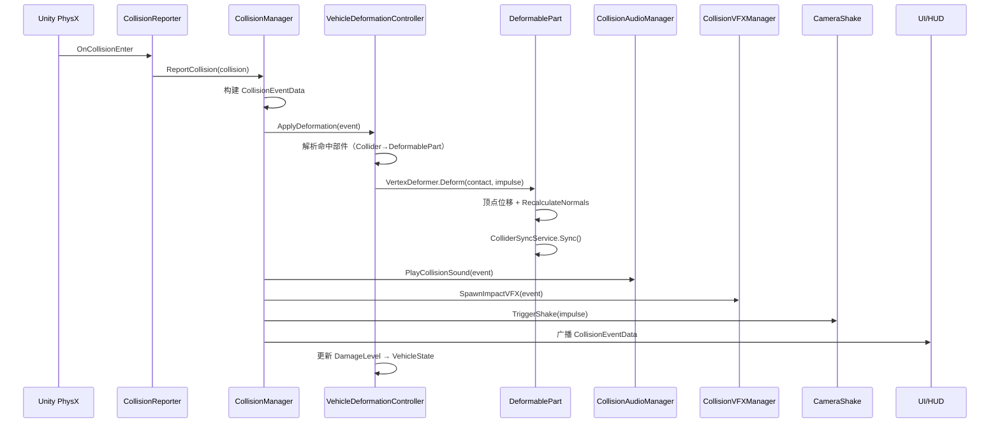

# 车辆碰撞虚拟仿真系统 — 碰撞系统详细设计文档（Unity）

| 文档信息 | 内容 |
|----------|------|
| 项目名称 | 车辆碰撞虚拟仿真系统 |
| 文档版本 | **v2.0** |
| 编写日期 | 2026-06-07 |
| 文档类型 | 碰撞子系统详细设计说明书（SDD） |
| 目标引擎 | Unity 2022.3 LTS（PhysX 内置） |
| 依据文档 | 《碰撞系统需求说明书 v1.0》 |
| 形变方案 | **方案 A：运行时顶点形变（唯一方案）** |
| 模型前提 | 车辆已按部件拆分（轮胎、车门、前框、后框等） |

---

## 1. 设计概述

### 1.1 设计目标

在 Unity 中实现模块化、可配置、可答辩演示的碰撞子系统，满足需求说明书四项验收原则：

```
逼真碰撞 = 物理响应正确 + 形变表现可见 + 多材质差异化 + 交互可观测
```

本版设计明确：

1. **形变**：仅采用运行时顶点形变，不使用 Prefab 切换、Blend Shape。
2. **模型**：直接利用已拆分的部件 Mesh（前框、后框、车门、引擎盖等），每部件独立形变与 Collider 同步。
3. **视听**：碰撞音效、粒子特效、镜头抖动作为**必做模块**，与碰撞事件联动。

### 1.2 技术选型

| 组件 | Unity 方案 | 说明 |
|------|------------|------|
| 物理引擎 | PhysX（内置） | Rigidbody + Collider + PhysicMaterial |
| 车辆驱动 | WheelCollider + VehicleController | 轮胎部件仅视觉 + 碰撞，不参与形变 |
| 连续碰撞检测 | Continuous Dynamic | 防高速穿模（FR-C-04） |
| **形变** | **Mesh 顶点位移（方案 A）** | 按部件 Mesh 局部形变 |
| 参数配置 | ScriptableObject | 车辆 / 形变 / 环境 / 音效 / 特效 |
| UI | UGUI + TextMeshPro | 参数调节、HUD、曲线 |
| 数据可视化 | XCharts 或 LineRenderer | 力-时间 / 速度-时间 |
| **音效** | **AudioSource + AudioClip 池** | 按材质对与冲量选 Clip |
| **粒子** | **Particle System Prefab 池** | 火花 / 烟尘 / 碎屑 |
| **镜头** | **Cinemachine Impulse 或自写 CameraShake** | 强碰撞触发 |
| 事件通信 | ScriptableObject Event Channel | 模块解耦 |

### 1.3 设计原则

1. **一部件一 Mesh 一形变器**：每个可形变部件挂 `DeformablePart`，独立顶点缓冲与 Collider。
2. **轮胎不形变**：轮胎由 WheelCollider 驱动，碰撞反馈走音效/粒子，Mesh 不做顶点修改。
3. **碰撞与形变解耦**：`CollisionManager` 分发事件；形变、音效、粒子各自订阅。
4. **数据驱动**：阈值、深度、音效映射、粒子强度全部可 ScriptableObject 配置 + UI 调节。
5. **同帧顺序固定**：物理 → 碰撞事件 → 形变 → Collider 同步 → 视听反馈 → UI 刷新。

---

## 2. 系统架构

### 2.1 分层架构

```
┌────────────────────────────────────────────────────────────────┐
│  Presentation Layer                                            │
│  VehicleSelectUI | ParamPanel | HUD | ChartPanel | Reset       │
├────────────────────────────────────────────────────────────────┤
│  Application Layer                                             │
│  GameSessionController | SceneResetService | SlowMotionCtrl      │
├────────────────────────────────────────────────────────────────┤
│  Feedback Layer ★（必做）                                       │
│  CollisionAudioManager | CollisionVFXManager | CameraShake     │
├────────────────────────────────────────────────────────────────┤
│  Collision Domain                                              │
│  CollisionManager | CollisionEventRecorder | DamageEvaluator   │
├────────────────────────────────────────────────────────────────┤
│  Deformation Domain ★（方案 A）                                 │
│  VehicleDeformationController | DeformablePart | VertexDeformer│
│  ColliderSyncService | PartRegionRegistry                      │
├────────────────────────────────────────────────────────────────┤
│  Vehicle Domain                                                │
│  VehicleController | VehiclePhysicsProfile | VehicleState      │
│  MultiVehicleManager | InputRouter                             │
├────────────────────────────────────────────────────────────────┤
│  Environment Domain                                            │
│  EnvObjectBase | Plant | Bridge | Building | Guardrail         │
├────────────────────────────────────────────────────────────────┤
│  Unity PhysX Layer                                             │
│  Rigidbody | Collider | PhysicMaterial | WheelCollider         │
└────────────────────────────────────────────────────────────────┘
```

### 2.2 碰撞全链路数据流



### 2.3 工程目录结构

```
Assets/_Project/
├── Scenes/
│   └── CollisionDemo.unity
├── Scripts/
│   ├── Core/
│   │   ├── GameSessionController.cs
│   │   ├── SceneResetService.cs
│   │   └── Events/
│   │       └── CollisionEventChannel.cs
│   ├── Collision/
│   │   ├── CollisionManager.cs
│   │   ├── CollisionReporter.cs
│   │   ├── CollisionEventData.cs
│   │   ├── CollisionEventRecorder.cs
│   │   ├── DamageEvaluator.cs
│   │   └── CollisionMaterialPair.cs
│   ├── Deformation/
│   │   ├── VehicleDeformationController.cs
│   │   ├── DeformablePart.cs
│   │   ├── VertexDeformer.cs
│   │   ├── ColliderSyncService.cs
│   │   ├── PartRegionRegistry.cs
│   │   └── DeformationConfig.cs          (SO)
│   ├── Vehicle/
│   │   ├── VehicleController.cs
│   │   ├── VehiclePhysicsProfile.cs      (SO)
│   │   ├── VehicleState.cs
│   │   └── MultiVehicleManager.cs
│   ├── Environment/
│   │   ├── EnvObjectBase.cs
│   │   ├── PlantObject.cs
│   │   ├── BridgeObject.cs
│   │   └── BuildingObject.cs
│   ├── Feedback/
│   │   ├── CollisionAudioManager.cs
│   │   ├── CollisionAudioProfile.cs      (SO)
│   │   ├── CollisionVFXManager.cs
│   │   ├── CollisionVFXProfile.cs        (SO)
│   │   └── CameraShakeController.cs
│   └── UI/
│       ├── PhysicsParamPanel.cs
│       ├── DeformationParamPanel.cs
│       ├── CollisionHUD.cs
│       └── ChartPanel.cs
├── ScriptableObjects/
│   ├── Vehicles/
│   ├── Deformation/
│   ├── Audio/
│   └── VFX/
├── Prefabs/
│   ├── Vehicles/
│   ├── Environment/
│   └── VFX/
│       ├── VFX_Spark_Metal.prefab
│       ├── VFX_Dust_Concrete.prefab
│       ├── VFX_Debris_Metal.prefab
│       └── VFX_Leaf_Plant.prefab
├── Audio/
│   └── Collision/
│       ├── metal_metal_light.wav
│       ├── metal_metal_heavy.wav
│       ├── metal_concrete_light.wav
│       ├── metal_concrete_heavy.wav
│       ├── metal_plant.wav
│       └── scrape_loop.wav
└── Materials/
    └── PhysicMaterials/
```

---

## 3. 车辆 Prefab 与部件规范

### 3.1 层级结构（基于已拆分模型）

```
VehicleRoot                          [Rigidbody, VehicleController, VehicleDeformationController]
├── Colliders/                       [车身碰撞体，与视觉分离或同节点]
│   ├── Col_FrontBumper              [BoxCollider, DeformablePart → FrontBumper]
│   ├── Col_Hood                     [BoxCollider, DeformablePart → Hood]
│   ├── Col_RearBumper               [BoxCollider, DeformablePart → RearBumper]
│   ├── Col_Trunk                    [BoxCollider, DeformablePart → Trunk]
│   ├── Col_Door_FL / FR / RL / RR   [BoxCollider, DeformablePart → 对应门]
│   └── Col_Roof                     [BoxCollider, DeformablePart → Roof, 可选]
├── Visual/
│   ├── FrontBumper                  [MeshFilter, MeshRenderer, DeformablePart]
│   ├── Hood
│   ├── RearBumper
│   ├── Trunk
│   ├── Door_FL / FR / RL / RR
│   ├── Roof                         [可选]
│   └── Body_Other                   [不可形变辅件：后视镜、灯罩等]
├── Wheels/
│   ├── Wheel_FL                     [WheelCollider + 轮胎 Mesh，无形变]
│   ├── Wheel_FR
│   ├── Wheel_RL
│   └── Wheel_RR
└── Audio/
    └── EngineAudioSource            [行驶音效，与碰撞音分离]
```

### 3.2 部件分类与形变策略

| 部件 | 是否顶点形变 | Collider | 说明 |
|------|--------------|----------|------|
| 前框 / FrontBumper | ✓ | BoxCollider | 正面碰撞主形变区 |
| 引擎盖 / Hood | ✓ | BoxCollider | 正面碰撞延伸区 |
| 后框 / RearBumper | ✓ | BoxCollider | 追尾主形变区 |
| 后备箱 / Trunk | ✓ | BoxCollider | 追尾延伸区 |
| 车门 ×4 | ✓ | BoxCollider | 侧面碰撞主形变区 |
| 车顶 / Roof | ✓（可选） | BoxCollider | 侧翻/砸压 |
| **轮胎 ×4** | **✗** | WheelCollider | 仅物理驱动；撞植物等走音效/粒子 |
| 后视镜、灯罩等 | ✗ | 小 Box 或无 | 可随父级刚性运动，不单独形变 |

### 3.3 模型导入设置（必检）

对每个可形变部件 FBX / Mesh：

| 设置项 | 值 | 原因 |
|--------|-----|------|
| Read/Write Enabled | ✓ | 运行时读写顶点 |
| Generate Colliders | ✗ | 手动 Box 更可控 |
| Normals | Import 或 Calculate | 形变后需 RecalculateNormals |
| Mesh Compression | Off | 避免精度损失 |
| 顶点数建议 | 单部件 ≤ 3000 | 保证 NFR-P-03 |

### 3.4 Collider 与视觉对齐

**推荐模式：Col + Visual 同部件名，Collider 在 `Colliders/` 子树，Visual 在 `Visual/` 子树，共用同一 `DeformablePart` 组件实例（挂父节点）：**

```
FrontBumper_Part                     [DeformablePart, PartRegion=FrontBumper]
├── Col_FrontBumper                  [BoxCollider]
└── Mesh_FrontBumper                 [MeshFilter, MeshRenderer]
```

`DeformablePart` 持有 Mesh 引用与 BoxCollider 引用，形变后同步更新 Collider。

---

## 4. 物理层设计

### 4.1 Physics Layer

| Layer | 名称 | 对象 |
|-------|------|------|
| 6 | Vehicle | 车身 Collider（各部件 Box） |
| 7 | VehicleWheel | WheelCollider |
| 8 | Environment_Static | 建筑、桥墩 |
| 9 | Environment_SemiStatic | 护栏、桥附属 |
| 10 | Environment_Destructible | 植物 |
| 11 | Ground | 地面 |

**碰撞矩阵要点：**

- `VehicleWheel` 仅与 `Ground` 碰撞。
- `Vehicle` 与 `Vehicle`、`Environment_*`、`Ground` 碰撞。
- 车身部件 Collider 均在 `Vehicle` Layer，**不因拆分而改变 Layer**。

### 4.2 PhysicMaterial 默认值

| 资产 | Dynamic Friction | Static Friction | Bounciness | 用于 |
|------|------------------|-----------------|------------|------|
| PM_VehicleBody | 0.7 | 0.9 | 0.20 | 车身 Box |
| PM_Plant | 0.4 | 0.5 | 0.10 | 植物 |
| PM_Guardrail | 0.5 | 0.6 | 0.15 | 护栏 |
| PM_Concrete | 0.7 | 0.8 | 0.08 | 建筑/桥墩 |
| PM_Ground | 0.8 | 1.0 | 0.05 | 地面 |

`Bounce Combine = Minimum`，`Friction Combine = Average`。

### 4.3 Rigidbody 与防穿模

**车辆 Rigidbody：**

```
Mass:              来自 VehiclePhysicsProfile
Collision Detection: Continuous Dynamic
Interpolate:       Interpolate
Center of Mass:    略低于几何中心（减少翻车，可按实验放开）
Fixed Timestep:    0.01s（100 Hz）
```

**轮胎：** 仅 `WheelCollider` 子节点挂 Collider，不参与 `DeformablePart`。

### 4.4 冲量计算

在 `CollisionManager` 的 `OnCollisionEnter` 中：

```csharp
float ComputeImpulse(Collision collision)
{
    float impulse = 0f;
    Rigidbody rbA = collision.rigidbody;
    Rigidbody rbB = collision.otherRigidbody;

    foreach (ContactPoint cp in collision.contacts)
    {
        Vector3 vA = rbA != null ? rbA.GetPointVelocity(cp.point) : Vector3.zero;
        Vector3 vB = rbB != null ? rbB.GetPointVelocity(cp.point) : Vector3.zero;
        Vector3 relVel = vA - vB;
        float vn = Vector3.Dot(relVel, cp.normal);
        if (vn <= 0f) continue;

        float invMassA = rbA != null && !rbA.isKinematic ? 1f / rbA.mass : 0f;
        float invMassB = rbB != null && !rbB.isKinematic ? 1f / rbB.mass : 0f;
        float invSum = invMassA + invMassB;
        if (invSum <= 0f) continue;

        float e = GetRestitution(collision);
        impulse += (1f + e) * vn / invSum;
    }
    return impulse;
}
```

---

## 5. 碰撞事件系统

### 5.1 核心数据结构

```csharp
public enum CollisionType { VehicleVehicle, VehicleEnvironment }

public enum VehiclePartType
{
    FrontBumper, Hood, RearBumper, Trunk,
    DoorFL, DoorFR, DoorRL, DoorRR,
    Roof, Wheel, OtherNonDeformable
}

public enum DamageLevel { Intact = 0, Light = 1, Heavy = 2, Totaled = 3 }

public enum SurfaceMaterialType
{
    Metal, Concrete, Plant, Guardrail, Ground, Unknown
}

[System.Serializable]
public struct CollisionEventData
{
    public float Timestamp;
    public GameObject ObjectA;
    public GameObject ObjectB;
    public CollisionType Type;
    public VehiclePartType HitPart;       // 车辆被命中部件
    public DeformablePart HitDeformable;  // 可空，非车辆侧为 null
    public Vector3 ContactPoint;
    public Vector3 ContactNormal;
    public float RelativeVelocity;
    public float Impulse;
    public SurfaceMaterialType SurfaceA;
    public SurfaceMaterialType SurfaceB;
    public ContactPoint[] AllContacts;
}
```

### 5.2 CollisionReporter

挂载于 `VehicleRoot` 及需要上报的环境物体：

```csharp
public class CollisionReporter : MonoBehaviour
{
    [SerializeField] CollisionEntityProfile profile;

    void OnCollisionEnter(Collision c)
    {
        if (c.relativeVelocity.magnitude < profile.minReportSpeed) return;
        CollisionManager.Instance.Report(this, c);
    }
}
```

### 5.3 命中部件解析

**优先路径（拆分模型）：** 根据 `collision.contacts[0].thisCollider` 反查 `DeformablePart`。

```csharp
DeformablePart ResolveHitPart(Collision collision, GameObject vehicleRoot)
{
    foreach (ContactPoint cp in collision.contacts)
    {
        var part = cp.thisCollider.GetComponentInParent<DeformablePart>();
        if (part != null && part.VehicleRoot == vehicleRoot)
            return part;
    }
    // fallback：最近 DeformablePart 中心距离
    return PartRegionRegistry.FindClosestPart(vehicleRoot, collision.contacts[0].point);
}
```

因模型已按部件拆分且 Collider 一一对应，**通常无需法线推断**，命中率高于单 Mesh 整车。

### 5.4 事件分发

`CollisionEventChannel`（ScriptableObject）广播 `CollisionEventData`。

| 订阅者 | 动作 |
|--------|------|
| VehicleDeformationController | 顶点形变 |
| CollisionAudioManager | 播放音效 |
| CollisionVFXManager | 生成粒子 |
| CameraShakeController | 镜头抖动 |
| CollisionHUD / ChartPanel | UI 更新 |
| CollisionEventRecorder | 历史记录 |

---

## 6. 顶点形变系统设计 ★

### 6.1 模块职责

| 类 | 职责 |
|----|------|
| `VehicleDeformationController` | 车辆级形变入口、损伤累计、Reset |
| `DeformablePart` | 单部件：Mesh 副本、Collider 引用、形变状态 |
| `VertexDeformer` | 纯算法：顶点位移 + 法线重算 |
| `ColliderSyncService` | 形变后更新 BoxCollider size/center |
| `DeformationConfig` | ScriptableObject 形变参数 |

### 6.2 DeformablePart 生命周期

```csharp
public class DeformablePart : MonoBehaviour
{
    public VehiclePartType PartType;
    public MeshFilter meshFilter;
    public BoxCollider syncCollider;

    Mesh _workingMesh;           // Instantiate 副本，不修改资产
    Vector3[] _originalVerts;
    Vector3[] _workingVerts;
    float _accumulatedDepth;     // 本部件累计形变深度

    void Awake()
    {
        _workingMesh = Instantiate(meshFilter.sharedMesh);
        _workingMesh.MarkDynamic();
        meshFilter.mesh = _workingMesh;
        _originalVerts = _workingMesh.vertices;
        _workingVerts = (Vector3[])_originalVerts.Clone();
    }
}
```

**Reset 时：** 恢复 `_workingVerts = _originalVerts`，重建 Mesh，重置 Collider 与 `_accumulatedDepth`。

### 6.3 形变算法

**输入：** 接触点（世界坐标）、接触法线（指向车外）、冲量 `J`、配置 `DeformationConfig`。

**步骤：**

1. 转部件本地空间：`localHit`, `localNormal`。
2. 若 `J < deformThreshold` → 跳过。
3. 计算本次深度：`depth = Min(maxDepth, k * J)`，`k = maxDepth / (heavyThreshold - deformThreshold)`。
4. 累积：`totalDepth = Min(maxDepth, _accumulatedDepth + depth * accumulateRatio)`。
5. 对每个顶点 `v`：
   - `dist = Distance(v, localHit)`
   - 若 `dist > deformRadius` → 跳过
   - `factor = Pow(1 - dist/deformRadius, falloff)`
   - `v += (-localNormal) * depth * factor`
6. `mesh.vertices = _workingVerts`
7. `RecalculateNormals()` + `RecalculateBounds()`
8. `ColliderSyncService.SyncBox(syncCollider, localHit, localNormal, depth, deformRadius)`

**法线方向约定：** 形变沿 **部件内法线**（向车内凹陷），即 `-localNormal`（localNormal 为碰撞接触法线，由外指向车）。

### 6.4 视觉参数推荐表（答辩调参起点）

| 参数 | 轿车建议值 | 效果说明 |
|------|------------|----------|
| deformThreshold | 800 N·s | 低于此仅音效/粒子，无明显形变 |
| maxDeformDepth | 0.12 m | 单部件单次上限，防“橡皮脸” |
| deformRadius | 0.55 m | 前框可 0.7，车门可 0.45 |
| falloff | 2.0 | 越大边缘越陡；2~3 较自然 |
| accumulateRatio | 0.85 | 多次碰撞叠加效率 |
| maxVerticesPerFrame | 400 | 分帧形变上限 |

**按部件微调（DeformationConfig 内 PartOverrides）：**

| 部件 | maxDepth | radius | 说明 |
|------|----------|--------|------|
| FrontBumper | 0.15 m | 0.70 m | 吸能区，可凹深 |
| Hood | 0.10 m | 0.65 m | 略薄 |
| Door_* | 0.08 m | 0.45 m | 侧碰长条坑 |
| RearBumper | 0.12 m | 0.65 m | 同前框 |
| Trunk | 0.10 m | 0.60 m | — |

### 6.5 Collider 同步策略

形变后更新 **BoxCollider**（不烘焙 MeshCollider）：

```csharp
public static void SyncBox(BoxCollider box, Vector3 localHit, Vector3 localNormal,
                           float depth, float radius)
{
    // 沿法线方向压缩 box 的对应轴
    // 例：正面碰撞 → 减小 box.size.z，box.center.z 略前移
    // 压缩比例 ≈ depth / 原 box 该轴尺寸，上限 40%
    Vector3 size = box.size;
    Vector3 center = box.center;
    // 根据 localNormal 主方向选择轴（|normal.x| > |normal.z| → X 轴为侧面）
    ApplyAxisCompression(ref size, ref center, localNormal, depth);
    box.size = size;
    box.center = center;
}
```

**累积形变：** 每次 Sync 基于 **原始 Collider 快照** 叠加压缩，避免重复缩放误差。

### 6.6 损伤等级判定

`DamageEvaluator` 按 **全车累计冲量** 或 **最大部件深度比** 判定：

| 等级 | 条件（满足其一） |
|------|------------------|
| Intact | 累计冲量 < lightThreshold |
| Light | lightThreshold ≤ 累计 < heavyThreshold |
| Heavy | heavyThreshold ≤ 累计 < totaledThreshold |
| Totaled | 累计 ≥ totaledThreshold 或任一部件深度 > 70% maxDepth |

**驾驶性能（FR-D-06）：**

| 等级 | 最高速度 | 转向 |
|------|----------|------|
| Intact | 100% | 100% |
| Light | 90% | 95% |
| Heavy | 70% | 60% |
| Totaled | 20% 或禁止驱动 | 40% |

### 6.7 形变性能优化

1. **分帧形变**：顶点数 > `maxVerticesPerFrame` 时，Coroutine 分 2–3 帧写完。
2. **空间裁剪**：只遍历 `Bounds(localHit ± radius)` 内顶点；部件 Mesh 较小时可全量。
3. **LOD（可选）**：远处车辆禁用形变，仅播放音效。
4. **禁止形变的情况**：`HitPart == Wheel` 时跳过 VertexDeformer，仅触发 Feedback。

### 6.8 形变完整流程

```
OnCollisionEnter
  → CollisionManager 构建 CollisionEventData（含 HitDeformable）
  → VehicleDeformationController.Apply(event)
      → if HitDeformable == null || PartType == Wheel → return
      → if impulse < threshold → 仅累计冲量，不形变
      → VertexDeformer.Deform(part, contact, impulse)
      → ColliderSyncService.Sync(part)
      → DamageEvaluator.Update(vehicle, impulse, depth)
      → VehicleState.ApplyDamageLevel()
  → CollisionEventChannel.Raise(event)  // 音效/粒子/UI 并行
```

---

## 7. 碰撞音效系统设计 ★

### 7.1 设计目标

满足 FR-A-01、FR-A-04：**强度相关** + **材质区分**。

### 7.2 CollisionAudioProfile（ScriptableObject）

```csharp
[CreateAssetMenu(menuName = "Config/CollisionAudioProfile")]
public class CollisionAudioProfile : ScriptableObject
{
    [System.Serializable]
    public class ClipSet
    {
        public AudioClip light;
        public AudioClip medium;
        public AudioClip heavy;
        public float volumeScale = 1f;
        public float pitchMin = 0.9f;
        public float pitchMax = 1.1f;
    }

    public ClipSet metalMetal;
    public ClipSet metalConcrete;
    public ClipSet metalPlant;
    public ClipSet metalGuardrail;
    public AudioClip scrapeLoop;           // 刮擦 OnCollisionStay

    public float lightImpulseThreshold = 500f;
    public float heavyImpulseThreshold = 4000f;
}
```

### 7.3 材质对映射

| Surface A | Surface B | ClipSet |
|-----------|-----------|---------|
| Metal | Metal | metalMetal |
| Metal | Concrete | metalConcrete |
| Metal | Plant | metalPlant |
| Metal | Guardrail | metalGuardrail |
| Metal | Ground | metalConcrete（可复用） |

`SurfaceMaterialType` 由 `CollisionEntityProfile` 或 `EnvironmentProfile` 声明。

### 7.4 CollisionAudioManager

```csharp
public class CollisionAudioManager : MonoBehaviour
{
    [SerializeField] CollisionAudioProfile profile;
    [SerializeField] int poolSize = 8;

    AudioSource[] _pool;

    public void OnCollision(CollisionEventData evt)
    {
        ClipSet set = ResolveClipSet(evt.SurfaceA, evt.SurfaceB);
        AudioClip clip = SelectByImpulse(set, evt.Impulse);
        if (clip == null) return;

        AudioSource src = GetFreeSource();
        src.transform.position = evt.ContactPoint;
        src.clip = clip;
        src.volume = Mathf.Lerp(0.3f, 1f, evt.Impulse / profile.heavyImpulseThreshold);
        src.pitch = Random.Range(set.pitchMin, set.pitchMax);
        src.Play();
    }
}
```

**强度分档：**

| 冲量 | 档位 | 表现 |
|------|------|------|
| < 500 | Light | 轻撞、刮蹭 |
| 500 – 4000 | Medium | 常规碰撞 |
| ≥ 4000 | Heavy | 重撞、金属闷响 |

**刮擦（FR-C-07 侧面刮擦）：** `OnCollisionStay` 且相对切向速度 > 阈值时，在接触点循环播放 `scrapeLoop`，音量随法向力变化。

### 7.5 音效资源建议

| 文件名 | 用途 | 时长 |
|--------|------|------|
| metal_metal_light.wav | 车-车轻碰 | 0.3–0.8s |
| metal_metal_heavy.wav | 车-车重撞 | 0.5–1.5s |
| metal_concrete_light/heavy | 车-墙/桥 | 同上 |
| metal_plant.wav | 车-植物 | 0.2–0.5s 短促 |
| scrape_loop.wav | 刮擦 | 可循环 1–2s |

> 可使用 Unity Asset Store 免费 SFX 包或 Freesound，README 中注明来源。

---

## 8. 碰撞粒子特效系统设计 ★

### 8.1 设计目标

满足 FR-A-02、FR-A-04：火花、烟尘，强度与材质相关。

### 8.2 CollisionVFXProfile（ScriptableObject）

```csharp
[CreateAssetMenu(menuName = "Config/CollisionVFXProfile")]
public class CollisionVFXProfile : ScriptableObject
{
    public GameObject sparkMetalPrefab;
    public GameObject dustConcretePrefab;
    public GameObject debrisMetalPrefab;
    public GameObject leafPlantPrefab;

    public float minImpulseForVFX = 300f;
    public float minImpulseForHeavyVFX = 2500f;
    public int poolSizePerType = 6;
}
```

### 8.3 材质 → 粒子映射

| 碰撞对 | 粒子 Prefab | 说明 |
|--------|-------------|------|
| Metal + Metal | Spark + Debris | 火花 + 小金属屑 |
| Metal + Concrete | Dust + Spark | 烟尘为主，少量火花 |
| Metal + Plant | Leaf | 叶片/碎屑，无火花 |
| Metal + Guardrail | Spark | 擦火花 |
| 任意（Heavy） | 上述 + 加强 emission | burst 数量 ×2 |

### 8.4 CollisionVFXManager

```csharp
public void OnCollision(CollisionEventData evt)
{
    if (evt.Impulse < profile.minImpulseForVFX) return;

    GameObject prefab = ResolveVFXPrefab(evt.SurfaceA, evt.SurfaceB, evt.Impulse);
    GameObject vfx = GetFromPool(prefab);
    vfx.transform.SetPositionAndRotation(
        evt.ContactPoint,
        Quaternion.LookRotation(evt.ContactNormal));

    var ps = vfx.GetComponent<ParticleSystem>();
    var main = ps.main;
    main.startSpeed = Mathf.Lerp(2f, 8f, evt.Impulse / 5000f);

    var emission = ps.emission;
    emission.SetBurst(0, new ParticleSystem.Burst(0f,
        (short)Mathf.Lerp(5, 30, evt.Impulse / 5000f)));

    ps.Play();
    StartCoroutine(ReturnToPoolAfter(vfx, main.duration + main.startLifetime.constantMax));
}
```

### 8.5 粒子 Prefab 制作要点

**VFX_Spark_Metal：**

- Duration 0.3–0.6s，One Shot
- Start Color 橙黄，Start Speed 3–10
- Emission Burst 10–40
- Shape：Cone，angle 25°
- Renderer：Billboard，Additive 材质

**VFX_Dust_Concrete：**

- Duration 0.8–1.2s
- Start Color 灰褐，Size 0.5–2
- 重力 modifier 0.2，扩散慢

**VFX_Leaf_Plant：**

- Mesh 或 Billboard 小叶片
- 数量少，Speed 低

### 8.6 对象池

每种 Prefab 预实例化 `poolSizePerType` 个，禁用挂 Pool 根节点下，避免 Instantiate 卡顿。

---

## 9. 镜头抖动（FR-A-03）

```csharp
public class CameraShakeController : MonoBehaviour
{
    [SerializeField] float minImpulse = 1500f;
    [SerializeField] float maxShakeAmplitude = 0.4f;

    public void OnCollision(CollisionEventData evt)
    {
        if (evt.Impulse < minImpulse) return;
        float strength = Mathf.InverseLerp(minImpulse, 8000f, evt.Impulse);
        StartCoroutine(Shake(strength * maxShakeAmplitude, 0.2f));
    }
}
```

**可选：** 使用 Cinemachine Impulse Source，与主相机 Virtual Camera 配合。

---

## 10. 车辆驾驶与环境

### 10.1 VehiclePhysicsProfile

| 字段 | 轿车默认 | SUV | 货车 |
|------|----------|-----|------|
| mass | 1350 | 2000 | 5000 |
| maxMotorTorque | 3000 | 4000 | 6000 |
| maxBrakeTorque | 5000 | 6000 | 8000 |
| maxSpeedKmh | 150 | 130 | 100 |

### 10.2 环境物体

| 类型 | 脚本 | 形变主体 | 粒子/音效 |
|------|------|----------|-----------|
| 植物 | PlantObject | 车辆；植物倾倒 | leaf + metal_plant |
| 护栏 | GuardrailObject | 车辆 | spark + metal_guardrail |
| 桥墩 | BridgeObject | 车辆 | dust + metal_concrete |
| 建筑 | BuildingObject | 车辆 | dust + heavy debris |

环境侧挂 `CollisionReporter` + `EnvironmentProfile`（含 SurfaceMaterialType、PhysicMaterial）。

---

## 11. UI 与场景重置

### 11.1 UI 面板

| 面板 | 功能 |
|------|------|
| PhysicsParamPanel | 质量、驱动力、摩擦、恢复系数 |
| DeformationParamPanel | 形变阈值、深度、半径、falloff |
| CollisionHUD | 车速、加速度、最近冲量、损伤等级 |
| ChartPanel | 力-时间 / 速度-时间 |
| SceneControlPanel | 重置、慢动作 |

### 11.2 SceneResetService

重置范围：

1. 车辆 Transform、Rigidbody 速度
2. 所有 `DeformablePart` Mesh 顶点 + BoxCollider
3. `DamageEvaluator` 累计值
4. 可破坏环境物体状态
5. 粒子池回收、Audio 停止
6. 图表缓冲清空

---

## 12. 需求追溯矩阵

| 需求 | 设计章节 | 实现 |
|------|----------|------|
| FR-D-01~05 | §6 | 顶点形变 + 部件 Collider 同步 |
| FR-D-03 | §3, §6 | 拆分部件 → DeformablePart 直接命中 |
| FR-C-06~08 | §5 | CollisionEventData + 记录器 |
| FR-A-01~04 | §7, §8 | 音效 + 粒子 + 材质映射 |
| FR-E-01~05 | §10 | 环境脚本 + Profile |
| FR-U-01~11 | §11 | UI + Reset |
| NFR-P-03 | §6.7 | 分帧形变 + 顶点上限 |

---

## 13. 验收用例对照

| 用例 | 预期 |
|------|------|
| TC-02 轿车追尾货车 | 轿车 FrontBumper/Hood 顶点凹陷，音效 heavy，火花 |
| TC-03 侧面撞护栏 | Door 部件形变，Guardrail 火花，护栏微移 |
| TC-04 正面撞建筑 | 前框深度形变 + 烟尘 + 重音效 + 镜头抖 |
| TC-05 撞植物 | 叶片粒子 + 植物倒伏，形变小 |
| TC-06 连续碰撞 | 同部件顶点累积加深，损伤升级 |
| TC-11 形变可见 | 部件 Mesh 对比截图 |
| TC-12 连锁碰撞 | A→B→护栏 三次事件均有形变/音/粒子 |

---

## 14. 开发计划

| 阶段 | 天数 | 交付 |
|------|------|------|
| P0 车辆与物理 | 3 | Prefab 层级、Layer、驾驶、部件 Collider |
| P1 碰撞事件 | 2 | CollisionManager、EventData、HUD 基础 |
| P2 顶点形变 | 4 | DeformablePart、VertexDeformer、ColliderSync |
| P3 视听反馈 | 2 | 音效池、粒子池、CameraShake |
| P4 环境与 UI | 3 | 植物/桥/建筑、参数面板、Reset |
| P5 联调 | 2 | 调参、性能、README |

| 成员 | 模块 |
|------|------|
| A | 场景、环境 Prefab、Layer |
| B | VehicleController、轮胎 WheelCollider |
| C | CollisionManager、物理参数 |
| D | **顶点形变 + Collider 同步** |
| E | **音效 + 粒子 + UI + 集成** |

---

## 15. 风险与对策

| 风险 | 对策 |
|------|------|
| 形变显假 | 按 §6.4 参数表；部件拆分 + 分部件 radius/depth |
| 形变卡顿 | 分帧 + maxVerticesPerFrame |
| Collider 不同步 | 基于原始 Box 快照累积压缩 |
| 音效重叠爆音 | AudioSource 池 + 同帧同点限 1 个 heavy |
| 粒子过多 | 池化 + impulse 阈值 + 同点 0.1s 冷却 |

---

## 16. 附录

### 附录 A：DeformationConfig 完整字段

```csharp
[CreateAssetMenu(menuName = "Config/DeformationConfig")]
public class DeformationConfig : ScriptableObject
{
    public float deformThreshold = 800f;
    public float maxDeformDepth = 0.12f;
    public float deformRadius = 0.55f;
    public float falloff = 2f;
    public float accumulateRatio = 0.85f;
    public int maxVerticesPerFrame = 400;

    public float lightDamageThreshold = 2000f;
    public float heavyDamageThreshold = 6000f;
    public float totaledThreshold = 12000f;

    public PartDeformOverride[] partOverrides;
}

[System.Serializable]
public struct PartDeformOverride
{
    public VehiclePartType part;
    public float maxDepth;
    public float radius;
}
```

### 附录 B：Unity Physics 项目设置

```
Fixed Timestep: 0.01
Default Solver Iterations: 8
Default Contact Offset: 0.01
```

### 附录 C：修订记录

| 版本 | 日期 | 内容 |
|------|------|------|
| v1.0 | 2026-06-07 | 初稿（多形变方案） |
| v2.0 | 2026-06-07 | 仅方案 A；拆分部件模型；音效/粒子必做 |

---

**文档结束**
